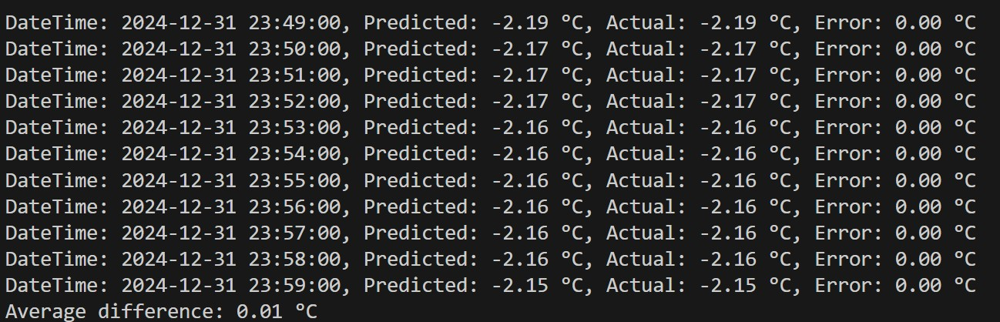
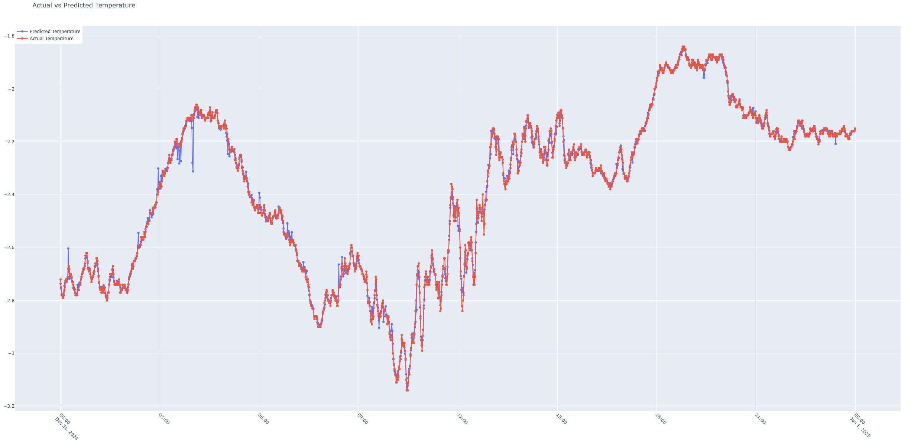

# Weather Forecast Using a Self-Built Weather Station (Scikit-learn)

## Project Overview

This project focuses on short-term temperature prediction using data collected from a self-built weather station.  
The station continuously recorded environmental parameters such as temperature, humidity, atmospheric pressure, rainfall, UV index, wind speed, and soil moisture.

The dataset used for training covers the period from **November 9, 2024, to December 31, 2024**.  
After training, the model was used to generate temperature predictions for **December 31, 2024**, and the predicted values were compared against the actual measurements.

The entire solution is implemented using **scikit-learn**, without relying on deep learning frameworks such as TensorFlow. This ensures compatibility with modern Python versions (including Python 3.14) and keeps the system lightweight, transparent, and reproducible.

---

## Data Source

All data used in this project was collected from a **custom-built weather station**.  
Measurements were recorded at high temporal resolution and stored in CSV format.

Each data record contains the following fields:

- Date
- Time
- Temperature
- Humidity
- Atmospheric pressure
- Rainfall during the last hour
- UV index
- Wind speed
- Soil moisture

The training dataset spans from November 9 to December 31, while a separate file contains measurements from December 31 used for evaluation and prediction.

---

## Feature Engineering and Preprocessing

Before training the model, several preprocessing steps are applied:

- The `Date` and `Time` columns are combined into a single datetime representation.
- Time-based features are extracted from the datetime:
  - Month
  - Day of year
  - Hour
  - Minute
  - Weekday
- All sensor measurements are converted to numeric values (string-encoded numbers are handled correctly).
- Missing or invalid values are replaced using mean imputation.
- Feature scaling is applied using standardization.

These steps allow the model to learn daily and seasonal temperature patterns effectively.

---

## Model Description

The prediction model is implemented as a **scikit-learn Pipeline**, which ensures consistent preprocessing during both training and inference.

Pipeline components:
1. **SimpleImputer** – replaces missing values using the mean.
2. **StandardScaler** – standardizes feature values.
3. **RandomForestRegressor** – performs temperature regression using an ensemble of decision trees.

The model is trained using a train–validation split and evaluated with standard regression metrics:
- Mean Absolute Error (MAE)
- Root Mean Squared Error (RMSE)

---

## Results

After training, the model was applied to the measurements recorded on **December 31, 2024**.

For each timestamp, the program outputs:
- The predicted temperature
- The actual measured temperature
- The absolute prediction error

The model achieved a very high level of accuracy on this dataset, with an **average prediction error of approximately 0.01 °C**.  
This indicates that the model closely follows both short-term fluctuations and overall temperature trends.

---

## Console Output Example

The following image shows an excerpt of the console output, including predicted values, actual measurements, and prediction errors for individual timestamps.

---

## Visualization: Actual vs Predicted Temperature

An interactive Plotly visualization is generated to compare predicted and actual temperature values throughout the day.

The graph clearly demonstrates that the predicted temperature curve almost perfectly overlaps with the actual measurements, confirming the strong performance of the model.

---

## Project Structure

